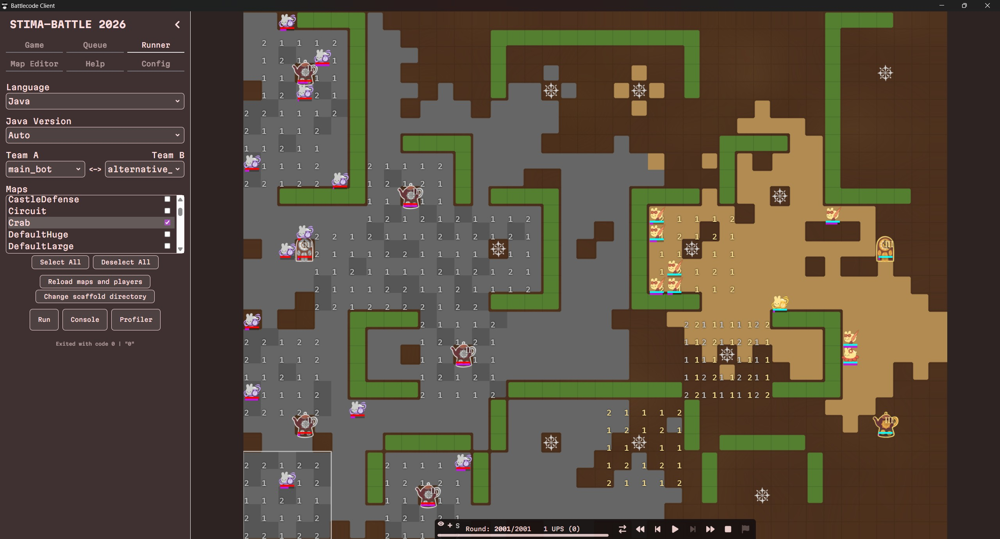

# Tugas Besar 1 IF2211 Strategi Algoritma

<p align="center">
  
</p>

**Battlecode 2025 Greedy Bot**

Repository ini berisi implementasi beberapa strategi **algoritma greedy** untuk bot Battlecode 2025.
Setiap bot mengambil keputusan secara lokal pada setiap turn dengan memilih aksi yang dianggap paling menguntungkan berdasarkan kondisi permainan saat itu.

---

# Strategi Bot

Repository ini memiliki tiga strategi bot:

1. **Main Bot – Money Tower Spam**
2. **Alternative Bot 1 – Weakest Enemy First**
3. **Alternative Bot 2 – Frontier Expansion Greedy**

---

# 1. Main Bot – Money Tower Spam

Strategi ini berfokus pada **pertumbuhan ekonomi tim** dengan membangun sebanyak mungkin **Money Tower** pada tahap awal permainan. Pendekatan greedy digunakan dengan selalu memprioritaskan aksi yang meningkatkan jumlah resource tim, sehingga tim dapat menghasilkan lebih banyak unit dan tower dibandingkan lawan. Dengan keunggulan ekonomi ini, tim diharapkan dapat mendominasi permainan melalui produksi unit yang lebih stabil dan kemampuan ekspansi yang lebih cepat.

**Kelebihan**

- Pertumbuhan resource tim lebih cepat dibanding strategi lain
- Memungkinkan produksi unit dan tower dalam jumlah lebih besar
- Lebih kuat pada permainan jangka menengah hingga akhir

**Kekurangan**

- Kurang agresif pada awal permainan
- Jika ditekan musuh sejak awal, ekonomi bisa terganggu
- Membutuhkan waktu sebelum keunggulan ekonomi terasa

---

# 2. Alternative Bot 1 – Weakest Enemy First

Strategi ini berfokus pada **eliminasi musuh secepat mungkin** dengan menargetkan unit atau tower yang paling mudah dihancurkan terlebih dahulu. Pada setiap turn, bot memilih target dengan **HP paling rendah**, dan jika terdapat beberapa target dengan HP sama maka dipilih target yang paling dekat. Pendekatan greedy ini bertujuan untuk mengurangi kekuatan musuh secara cepat sehingga tim dapat memperoleh keunggulan dalam pertempuran dan memenangkan permainan melalui penghancuran seluruh unit dan tower lawan.

**Kelebihan**

- Agresif dalam pertempuran langsung
- Dapat mengurangi jumlah unit musuh dengan cepat
- Efektif pada peta kecil atau ketika musuh sering terlihat

**Kekurangan**

- Kurang fokus pada kontrol wilayah
- Kurang efektif jika musuh bermain defensif atau sulit ditemukan
- Performa menurun pada peta besar

---

# 3. Alternative Bot 2 – Frontier Expansion Greedy

Strategi ini berfokus pada **kontrol wilayah peta** dengan memperluas area yang dikuasai tim secepat mungkin. Bot mengevaluasi berbagai aksi yang dapat dilakukan dan memilih aksi yang memberikan peningkatan kontrol wilayah terbesar pada turn tersebut, seperti mengecat tile baru atau bergerak menuju area frontier antara wilayah tim dan wilayah netral. Dengan memperluas wilayah secara konsisten, tim dapat memperoleh lebih banyak ruang gerak, menemukan ruins lebih cepat, dan membangun tower lebih awal untuk memperkuat posisi di peta.

**Kelebihan**

- Ekspansi wilayah cepat
- Lebih stabil pada berbagai ukuran peta
- Mempermudah menemukan ruins dan membangun tower lebih awal

**Kekurangan**

- Kurang agresif dalam mengejar musuh
- Frontier dapat terdorong mundur jika musuh sangat agresif
- Unit bisa tersebar terlalu jauh jika koordinasi kurang

---

# Requirement

- **Java 21**
- **Gradle Wrapper (gradlew)**

---

# Build dan Menjalankan Program

Build project:

```bash
./gradlew build
```

Masuk ke folder client:

```bash
cd client
```

Jalankan aplikasi client yang tersedia di folder `client`.

### Windows

Jalankan file aplikasi client yang tersedia di folder `client`.

### Linux

Beri permission execute pada AppImage lalu jalankan:

```bash
chmod +x "Stima Battle Client".AppImage
```

```bash
./"Stima Battle Client".AppImage
```

---

# Author

13524053 – Muhammad Haris Putra Sulastianto\
13524071 – Kalyca Nathania Benedicta Manullang\
13524091 – Vara Azzara Ramli Pulukadang
